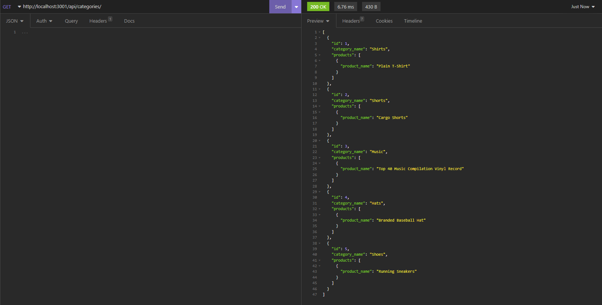

# E-Commerce-Back-End

## Description

Internet retail, also known as e-commerce, is the largest sector of the electronics industry, having generated an estimated US$29 trillion in 2017 (Source: United Nations Conference on Trade and Development). E-commerce platforms like Shopify and WooCommerce provide a suite of services to businesses of all sizes. Due to the prevalence of these platforms, developers should understand the fundamental architecture of e-commerce sites.

In this application, we can access the API of the E-Commerce site. For this, it is possible to access product information from the database by using Insomnia. You can also add and delete information from the database. To start using it, you can enter the "npm run seed" and "node server.js" commands from the terminal and use the "GET", "PUT", "POST" and "DELETE" commands in Insomnia.

Here is a Screenshot of the App:

Here is the link of the Video:
https://drive.google.com/file/d/1eyno59twSoUIWNXw_C4z9ngwZ9FsheNP/view
